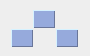

# Java-Tetris-Game
Java Tetris game clone source code. Uses Java 12.  
https://zetcode.com/javagames/tetris/


# Changes in this update

In this update, we have added new shape in this game and also updated the scoring system.

## New Shape

This is the new Hat Shape which has been added.



It is achieved by declaring new shape in Shape.java and providing coordinates of each block in this shape.

```java
protected enum Tetrominoe { NoShape, ZShape, SShape, LineShape,
    TShape, SquareShape, LShape, MirroredLShape, HatShape }
```

Co-ordinates of blocks in new shape

```java
coordsTable = new int[][][] {
    { { 0, 0 },   { 0, 0 },   { 0, 0 },   { 0, 0 } },
    { { 0, -1 },  { 0, 0 },   { -1, 0 },  { -1, 1 } },
    { { 0, -1 },  { 0, 0 },   { 1, 0 },   { 1, 1 } },
    { { 0, -1 },  { 0, 0 },   { 0, 1 },   { 0, 2 } },
    { { -1, 0 },  { 0, 0 },   { 1, 0 },   { 0, 1 } },
    { { 0, 0 },   { 1, 0 },   { 0, 1 },   { 1, 1 } },
    { { -1, -1 }, { 0, -1 },  { 0, 0 },   { 0, 1 } },
    { { 1, -1 },  { 0, -1 },  { 0, 0 },   { 0, 1 } },
    { { 0, 0 },  { 0, 0 },  { 1, -1 },   { 2, 0 } }    //co-ordinates of blocks in new shape
};
```

Including new shape in randomization

```java
int x = Math.abs(r.nextInt()) % 8 + 1;
```

## New scoring system

We have introduced new bonus points if you complete more than one line at a time.
Breakdown of bonus points is as follows.

- 2 lines --> 1 bonus point
- 3 lines --> 2 bonus points
- 4 lines --> 5 bonus points

```java
private Integer[] bonus = {0, 0, 1, 2, 5};
// bonus is provided by using numFullLines as index in this array
```

Including bonus in total score (numLinesRemoved) and providing custom message if bonus applied.

```java
numLinesRemoved += numFullLines + bonus[numFullLines];

String bonusText = ((bonus[numFullLines] > 0) ? " (bonus +" + bonus[numFullLines] + ")" : "");

statusbar.setText(String.valueOf(numLinesRemoved + bonusText));
```

Color for new shape

```java
Color colors[] = {new Color(0, 0, 0), new Color(204, 102, 102),
        new Color(102, 204, 102), new Color(102, 102, 204),
        new Color(204, 204, 102), new Color(204, 102, 204),
        new Color(102, 204, 204), new Color(218, 170, 0),
        new Color(150, 170, 220)        //sky blue color for new shape
};
```
